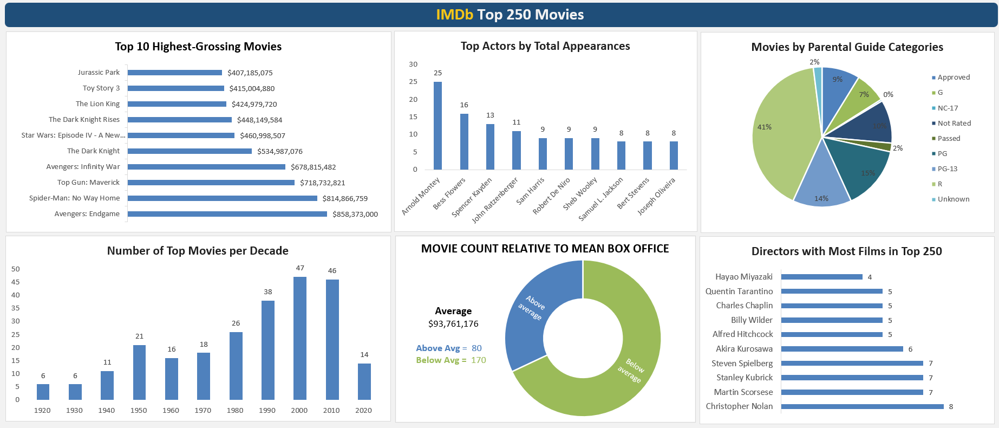
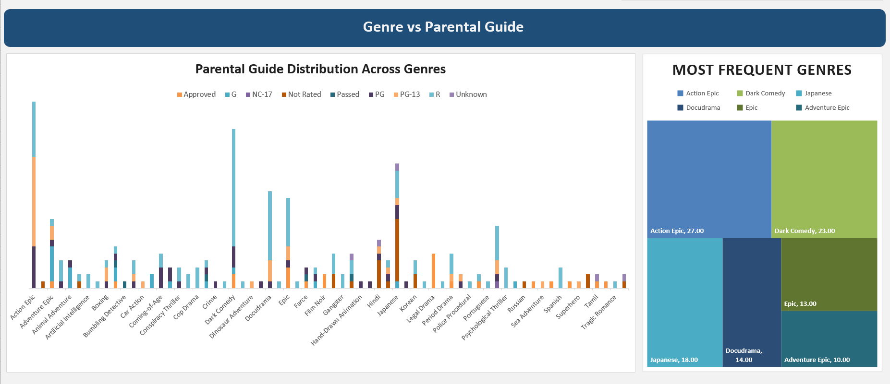
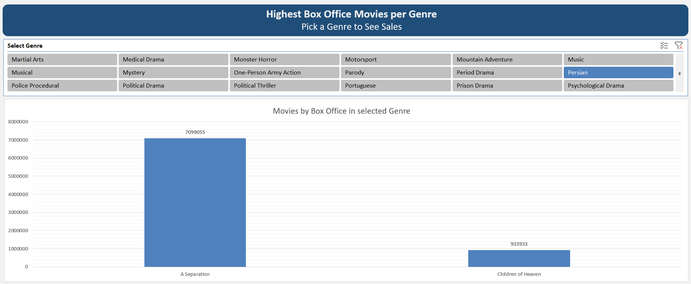

# IMDb Top 250 Dashboard Scraper

This project scrapes data from the IMDb Top 250 movies page, extracts key movie details from each film page, cleans the collected data, and exports the final dataset to Excel.

The repository also includes an Excel-based dashboard for exploring the scraped movie data.

---

## Project Overview

The main script, `crawl.py`, uses a combination of **Selenium**, **Requests**, and **BeautifulSoup** to collect information from IMDb Top 250 movie pages.

The extracted data is saved into an Excel file and can be used for analysis and dashboard creation.

---

## Features

- Scrapes the IMDb Top 250 movies list
- Collects movie detail page links
- Extracts metadata from each movie page
- Gets directors, writers, and stars
- Cleans list-based fields
- Exports the final dataset to Excel
- Supports Excel dashboard analysis

---

## Scraped Data

The final dataset includes the following columns:

- `movie_id`
- `title`
- `year`
- `parental_guide`
- `runtime`
- `genre`
- `directore`
- `writer`
- `star`
- `gross_us_canada`


---

## Technologies Used

- Python
- Selenium
- Requests
- BeautifulSoup
- Pandas
- Excel

---

## How It Works

### 1. Open IMDb Top 250 page
The script opens the IMDb Top 250 page in headless Chrome and collects all movie links.

### 2. Scrape each movie page
For each movie, the script extracts:
- movie ID
- title
- year
- parental guide
- runtime
- genre
- directors
- writers
- stars
- gross US & Canada

### 3. Clean the data
List values are converted into comma-separated strings for easier analysis.

### 4. Export to Excel
The final cleaned dataset is saved as:
```text
imdb_Top250Movies.xlsx
```
---

## Dashboard Preview

### IMDb Dashboard Overview


### Genre vs Parental Guide


### Box Office by Genre


